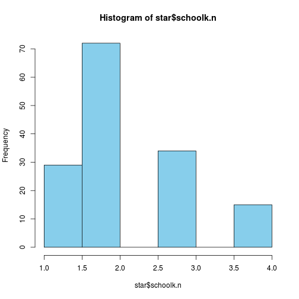

Basic Data Transformations in R
========================================================
## Setup
### Options chunk

```r
opts_knit$set(root.dir = "../../../")
```


### Data chunk

```r
source("data/starRmake.R")
```

```
## Loading required package: Hmisc
## Loading required package: grid
## Loading required package: lattice
## Loading required package: survival
## Loading required package: splines
## Loading required package: Formula
## 
## Attaching package: 'Hmisc'
## 
## The following object is masked from 'package:psych':
## 
##     describe
## 
## The following objects are masked from 'package:base':
## 
##     format.pval, round.POSIXt, trunc.POSIXt, units
## 
## Loading required package: tcltk
## Loading required package: tkrplot
## Loading required package: VIM
## Loading required package: colorspace
## VIM is ready to use. 
##  Since version 4.0.0 the GUI is in its own package VIMGUI.
## 
##           Please use the package to use the new (and old) GUI.
## 
## 
## Attaching package: 'VIM'
## 
## The following object is masked from 'package:datasets':
## 
##     sleep
## 
## Loading required package: survey
## 
## Attaching package: 'survey'
## 
## The following object is masked from 'package:Hmisc':
## 
##     deff
## 
## The following object is masked from 'package:graphics':
## 
##     dotchart
## 
## Loading required package: gWidgetsRGtk2
## Loading required package: RGtk2
## Loading required package: gWidgets
## VIM is ready to use. 
##  (Enter vmGUImenu() to start the OLD graphical user interface.)
## 
##     Enter VIMGUI() to start the NEW graphical user interface.
```

## Transforming the Variable Class

### Factor to Numeric

```r

class(star$schoolk)
```

```
## [1] "factor"
```

```r
star$schoolk.n <- as.numeric(star$schoolk)
hist(star$schoolk.n, col = "skyblue")
```

 


### Numeric to Factor


```r
# look at the readk variable (numeric)
hist(star$readk, col = "skyblue")
```

 

```r
# set break points
brks <- c(0, 425, 475, 525, Inf)
star$readk.fac <- cut(star$readk, breaks = brks)
class(star$readk.fac)
```

```
## [1] "factor"
```

```r
barplot(table(star$readk.fac))
```

 

```r
# with labels
star$readk.fac <- cut(star$readk, breaks = brks, labels = c("low", "low med", 
    "hi med", "hi"))

barplot(table(star$readk.fac))
```

 

## Recoding  Variables

```r
library(car)
```

```
## 
## Attaching package: 'car'
## 
## The following object is masked from 'package:psych':
## 
##     logit
```

```r
# factor
star$readk.fac <- recode(star$readk.fac, "'low med'='med'; c('hi med', 'hi')= 'hi'")
barplot(table(star$readk.fac))
```

 

```r
# reorder factors
star$readk.fac <- factor(star$readk.fac, levels = c("low", "med", "hi"))
# or, using original recode function with levels argument
star$readk.fac <- recode(star$readk.fac, "'low med'='med'; c('hi med', 'hi')= 'hi'", 
    levels = c("low", "med", "hi"))
barplot(table(star$readk.fac))
```

 

```r
# another factor
barplot(table(star$schoolk))
```

 

```r
star$schoolk.3 <- recode(star$schoolk, "c('suburban', 'urban')='urban'")
barplot(table(star$schoolk.3))
```

 

```r

# numeric
star$schoolk.3n <- recode(star$schoolk.n, "3:4=4")
barplot(table(star$schoolk.3n))
```

 


## Dummy Code variables

```r
# YOU DON'T NEED TO FOR REGRESSION IN R!!
table(star$stark)
```

```
## 
##      regular regular+aide        small 
##           51           55           44
```

```r
mod <- lm(read1 ~ stark, star)
summary(mod)
```

```
## 
## Call:
## lm(formula = read1 ~ stark, data = star)
## 
## Residuals:
##    Min     1Q Median     3Q    Max 
## -94.37 -40.70  -6.41  30.59 133.30 
## 
## Coefficients:
##                   Estimate Std. Error t value Pr(>|t|)    
## (Intercept)         517.70      10.39   49.81   <2e-16 ***
## starkregular+aide    12.67      13.90    0.91     0.36    
## starksmall            4.71      14.82    0.32     0.75    
## ---
## Signif. codes:  0 '***' 0.001 '**' 0.01 '*' 0.05 '.' 0.1 ' ' 1
## 
## Residual standard error: 56.9 on 94 degrees of freedom
##   (53 observations deleted due to missingness)
## Multiple R-squared:  0.00912,	Adjusted R-squared:  -0.012 
## F-statistic: 0.433 on 2 and 94 DF,  p-value: 0.65
```

```r

# Dummy coding with the dummies package install.packages('dummies')
library(dummies)
```

```
## dummies-1.5.6 provided by Decision Patterns
```

```r
stark.dumdf <- dummy(star$stark)
star <- dummy.data.frame(star, names = "stark")
```


## Using  ```dplyr``` Package

```r
library(dplyr)
```

```
## 
## Attaching package: 'dplyr'
## 
## The following object is masked from 'package:gWidgetsRGtk2':
## 
##     id
## 
## The following object is masked from 'package:gWidgets':
## 
##     id
## 
## The following objects are masked from 'package:Hmisc':
## 
##     src, summarize
## 
## The following objects are masked from 'package:stats':
## 
##     filter, lag
## 
## The following objects are masked from 'package:base':
## 
##     intersect, setdiff, setequal, union
```

```r
head(star)
```

```
##   gender ethnicity   birth starkregular starkregular+aide starksmall readk
## 1 female      cauc 1980 Q3            0                 0          1   443
## 2 female      cauc 1979 Q4            1                 0          0   492
## 3 female      afam 1979 Q4            0                 1          0   398
## 4 female      afam 1980 Q1            0                 1          0   419
## 5 female      afam 1980 Q2            1                 0          0   360
## 6   male      cauc 1979 Q3            0                 0          1   451
##   read1 mathk math1   lunchk    schoolk schoolidk schoolk.n readk.fac
## 1    NA   520    NA non-free   suburban        41         3       med
## 2   540   513   557     free      rural        11         2        hi
## 3    NA   405   444     free      rural        56         2       low
## 4   453   444   479     free inner-city        14         1       low
## 5    NA   320    NA     free inner-city        33         1       low
## 6   571   506   627 non-free   suburban         4         3       med
##    schoolk.3 schoolk.3n
## 1      urban          4
## 2      rural          2
## 3      rural          2
## 4 inner-city          1
## 5 inner-city          1
## 6      urban          4
```

```r

df <- tbl_df(star)

fem.df <- filter(df, gender == "female")
fem2.df <- df[df$gender == "female", ]
male.df <- filter(df, gender == "male")

fem.df <- arrange(fem.df, readk)
head(fem.df)
```

```
## Source: local data frame [6 x 17]
## 
##   gender ethnicity   birth starkregular starkregular+aide starksmall readk
## 1 female      afam 1980 Q2            1                 0          0   360
## 2 female      afam 1980 Q3            0                 1          0   388
## 3 female      cauc 1980 Q3            1                 0          0   390
## 4 female      cauc 1980 Q2            0                 0          1   397
## 5 female      cauc 1980 Q3            0                 0          1   397
## 6 female      afam 1979 Q4            0                 1          0   398
## Variables not shown: read1 (int), mathk (int), math1 (int), lunchk (fctr),
##   schoolk (fctr), schoolidk (int), schoolk.n (dbl), readk.fac (fctr),
##   schoolk.3 (fctr), schoolk.3n (dbl)
```

