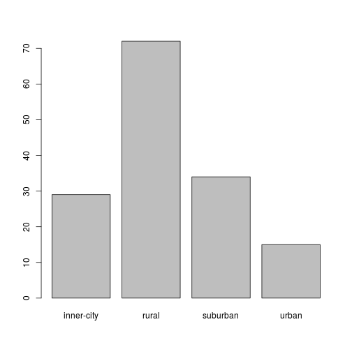
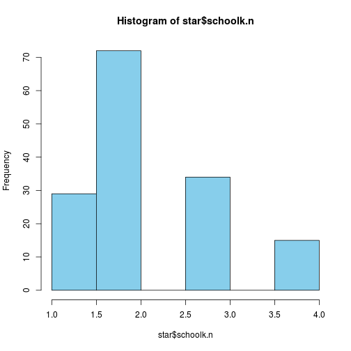
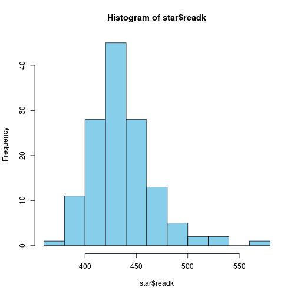
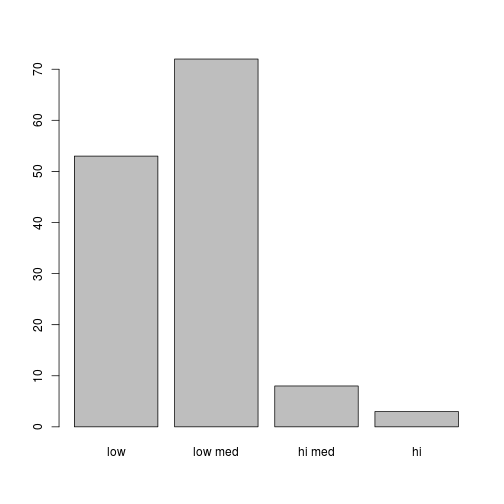
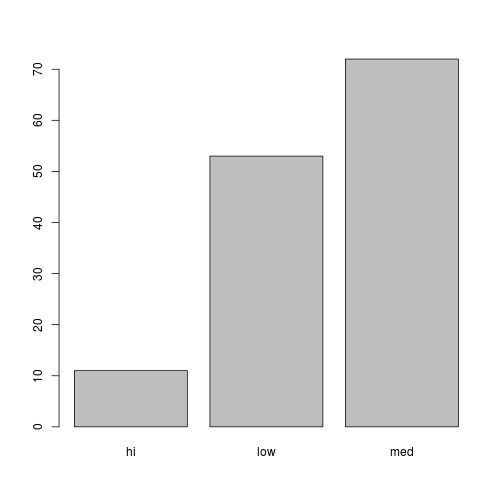
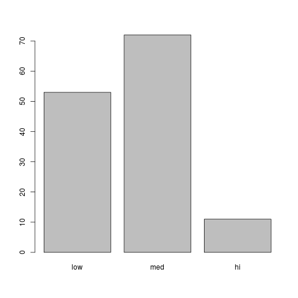
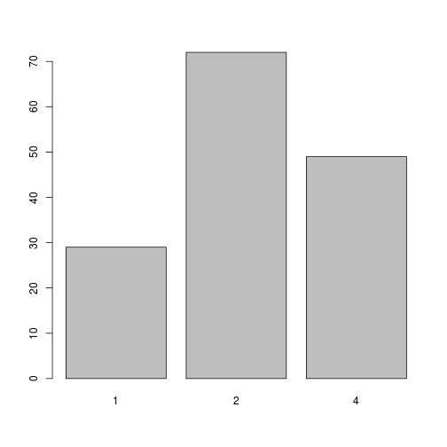

Basic Data Transformations in R
========================================================
## Setup
### Options chunk

```r
opts_knit$set(root.dir = "../../../")
```


### Data chunk

```r
# source('data/starRmake.R')
star <- read.csv(file = "data/star.csv", header = TRUE)
```


## Transforming the Variable Class
Data transformations focus on taking raw variables and modifying them so they are more appropriate for the planned analysis.  We hav previously discussed how to explore your data (e.g. evaluate distributions, look for outliers). In this tutorial we consider functions useful in making changes to variables once they are identified as problematic.

### Factor to Numeric

```r

class(star$schoolk)
```

```
## [1] "factor"
```

```r
barplot(table(star$schoolk))
```

 

```r
star$schoolk.n <- as.numeric(star$schoolk)
hist(star$schoolk.n, col = "skyblue")
```

 


### Numeric to Factor


```r
# look at the readk variable (numeric)
hist(star$readk, col = "skyblue")
```

 

```r
# set break points
brks <- c(0, 425, 475, 525, Inf)
star$readk.fac <- cut(star$readk, breaks = brks)
class(star$readk.fac)
```

```
## [1] "factor"
```

```r
barplot(table(star$readk.fac))
```

 

```r
# with labels
star$readk.fac <- cut(star$readk, breaks = brks, labels = c("low", "low med", 
    "hi med", "hi"))

barplot(table(star$readk.fac))
```

 

## Recoding  Variables

```r
library(car)
# factor
star$readk.fac <- recode(star$readk.fac, "'low med'='med'; c('hi med', 'hi')= 'hi'")
barplot(table(star$readk.fac))
```

 

```r
# reorder factors
star$readk.fac <- factor(star$readk.fac, levels = c("low", "med", "hi"))
# or, using original recode function with levels argument
star$readk.fac <- recode(star$readk.fac, "'low med'='med'; c('hi med', 'hi')= 'hi'", 
    levels = c("low", "med", "hi"))
barplot(table(star$readk.fac))
```

 

```r
# another factor
barplot(table(star$schoolk))
```

 

```r
star$schoolk.3 <- recode(star$schoolk, "c('suburban', 'urban')='urban'")
barplot(table(star$schoolk.3))
```

 

```r

# numeric
star$schoolk.3n <- recode(star$schoolk.n, "3:4=4")
barplot(table(star$schoolk.3n))
```

 


## Dummy Code variables

```r
# YOU DON'T NEED TO FOR REGRESSION IN R!!
table(star$stark)
```

```
## 
##      regular regular+aide        small 
##           51           55           44
```

```r
mod <- lm(read1 ~ stark, star)
summary(mod)
```

```
## 
## Call:
## lm(formula = read1 ~ stark, data = star)
## 
## Residuals:
##    Min     1Q Median     3Q    Max 
## -94.37 -40.70  -6.41  30.59 133.30 
## 
## Coefficients:
##                   Estimate Std. Error t value Pr(>|t|)    
## (Intercept)         517.70      10.39   49.81   <2e-16 ***
## starkregular+aide    12.67      13.90    0.91     0.36    
## starksmall            4.71      14.82    0.32     0.75    
## ---
## Signif. codes:  0 '***' 0.001 '**' 0.01 '*' 0.05 '.' 0.1 ' ' 1
## 
## Residual standard error: 56.9 on 94 degrees of freedom
##   (53 observations deleted due to missingness)
## Multiple R-squared:  0.00912,	Adjusted R-squared:  -0.012 
## F-statistic: 0.433 on 2 and 94 DF,  p-value: 0.65
```

```r

# Dummy coding with the dummies package install.packages('dummies')
library(dummies)
```

```
## dummies-1.5.6 provided by Decision Patterns
```

```r
stark.dumdf <- dummy(star$stark)
star <- dummy.data.frame(star, names = "stark")
```


## Using  ```dplyr``` Package

```r
library(dplyr)
```

```
## 
## Attaching package: 'dplyr'
## 
## The following objects are masked from 'package:stats':
## 
##     filter, lag
## 
## The following objects are masked from 'package:base':
## 
##     intersect, setdiff, setequal, union
```

```r
head(star)
```

```
##        X gender ethnicity   birth starkregular starkregular+aide
## 1 179449 female      cauc 1980 Q3            0                 0
## 2  82199 female      cauc 1979 Q4            1                 0
## 3  68952 female      afam 1979 Q4            0                 1
## 4  32609 female      afam 1980 Q1            0                 1
## 5  11196 female      afam 1980 Q2            1                 0
## 6 122089   male      cauc 1979 Q3            0                 0
##   starksmall        star1        star2        star3 readk read1 read2
## 1          1         <NA>         <NA>         <NA>   443    NA    NA
## 2          0 regular+aide regular+aide         <NA>   492   540   637
## 3          0      regular regular+aide regular+aide   398    NA   514
## 4          0 regular+aide      regular      regular   419   453   518
## 5          0         <NA>         <NA>         <NA>   360    NA    NA
## 6          1        small        small        small   451   571   611
##   read3 mathk math1 math2 math3   lunchk   lunch1   lunch2   lunch3
## 1    NA   520    NA    NA    NA non-free     <NA>     <NA>     <NA>
## 2    NA   513   557   587    NA     free     free     free     <NA>
## 3    NA   405   444   497    NA     free     free     free     free
## 4   562   444   479   523   546     free     free     free     free
## 5    NA   320    NA    NA    NA     free     <NA>     <NA>     <NA>
## 6   616   506   627   632   711 non-free non-free non-free non-free
##      schoolk    school1    school2    school3  degreek  degree1  degree2
## 1   suburban       <NA>       <NA>       <NA>   master     <NA>     <NA>
## 2      rural      rural      rural       <NA>   master bachelor bachelor
## 3      rural      rural      rural      rural bachelor bachelor   master
## 4 inner-city inner-city inner-city inner-city bachelor bachelor bachelor
## 5 inner-city       <NA>       <NA>       <NA>   master     <NA>     <NA>
## 6   suburban   suburban   suburban   suburban bachelor bachelor bachelor
##    degree3    ladderk    ladder1   ladder2 ladder3 experiencek experience1
## 1     <NA>     level1       <NA>      <NA>    <NA>          18          NA
## 2     <NA>     level2     level1 notladder    <NA>          11          16
## 3   master     level1  probation    level1  level1           7           3
## 4 bachelor apprentice  probation    level1  level1           1          17
## 5     <NA>  probation       <NA>      <NA>    <NA>           6          NA
## 6   master       <NA> apprentice    level1  level1           0           0
##   experience2 experience3 tethnicityk tethnicity1 tethnicity2 tethnicity3
## 1          NA          NA        cauc        <NA>        <NA>        <NA>
## 2           4          NA        cauc        cauc        afam        <NA>
## 3          29          11        cauc        cauc        cauc        cauc
## 4          30          31        afam        afam        afam        afam
## 5          NA          NA        cauc        <NA>        <NA>        <NA>
## 6          14          18        cauc        cauc        cauc        cauc
##   systemk system1 system2 system3 schoolidk schoolid1 schoolid2 schoolid3
## 1      17      NA      NA      NA        41        NA        NA        NA
## 2       8       8       8      NA        11        11        11        NA
## 3      24      24      24      24        56        56        56        56
## 4      11      11      11      11        14        14        32        32
## 5      11      NA      NA      NA        33        NA        NA        NA
## 6       4       4       4       4         4         4         4         4
##   schoolk.n readk.fac  schoolk.3 schoolk.3n
## 1         3       med      urban          4
## 2         2        hi      rural          2
## 3         2       low      rural          2
## 4         1       low inner-city          1
## 5         1       low inner-city          1
## 6         3       med      urban          4
```

```r

df <- tbl_df(star)

fem.df <- filter(df, gender == "female")
fem2.df <- df[df$gender == "female", ]
male.df <- filter(df, gender == "male")

fem.df <- arrange(fem.df, readk)
head(fem.df)
```

```
## Source: local data frame [6 x 54]
## 
##        X gender ethnicity   birth starkregular starkregular+aide
## 1  11196 female      afam 1980 Q2            1                 0
## 2 174490 female      afam 1980 Q3            0                 1
## 3 160490 female      cauc 1980 Q3            1                 0
## 4  84844 female      cauc 1980 Q2            0                 0
## 5 117451 female      cauc 1980 Q3            0                 0
## 6  68952 female      afam 1979 Q4            0                 1
## Variables not shown: starksmall (int), star1 (fctr), star2 (fctr), star3
##   (fctr), readk (int), read1 (int), read2 (int), read3 (int), mathk (int),
##   math1 (int), math2 (int), math3 (int), lunchk (fctr), lunch1 (fctr),
##   lunch2 (fctr), lunch3 (fctr), schoolk (fctr), school1 (fctr), school2
##   (fctr), school3 (fctr), degreek (fctr), degree1 (fctr), degree2 (fctr),
##   degree3 (fctr), ladderk (fctr), ladder1 (fctr), ladder2 (fctr), ladder3
##   (fctr), experiencek (int), experience1 (int), experience2 (int),
##   experience3 (int), tethnicityk (fctr), tethnicity1 (fctr), tethnicity2
##   (fctr), tethnicity3 (fctr), systemk (int), system1 (int), system2 (int),
##   system3 (int), schoolidk (int), schoolid1 (int), schoolid2 (int),
##   schoolid3 (int), schoolk.n (dbl), readk.fac (fctr), schoolk.3 (fctr),
##   schoolk.3n (dbl)
```

