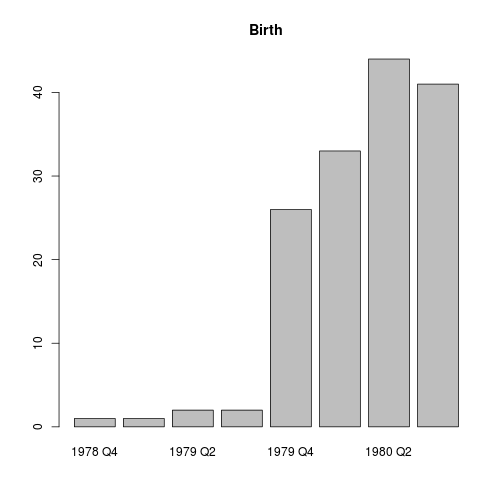
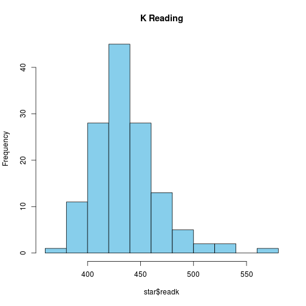
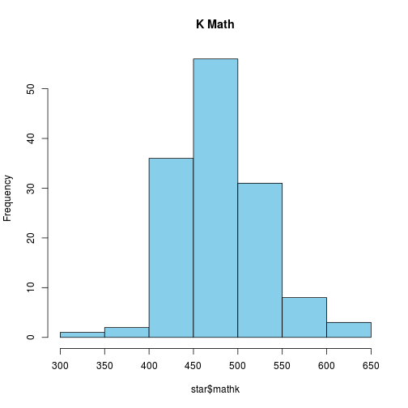
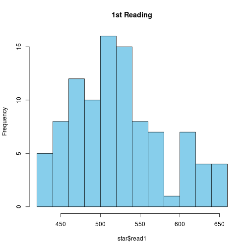
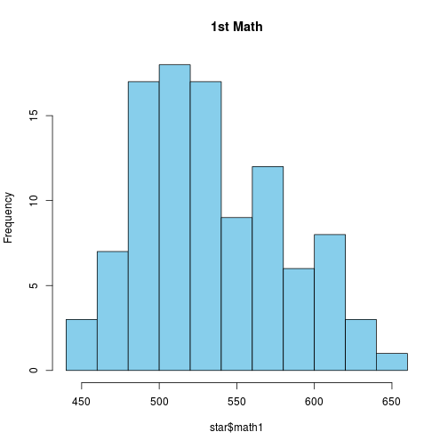
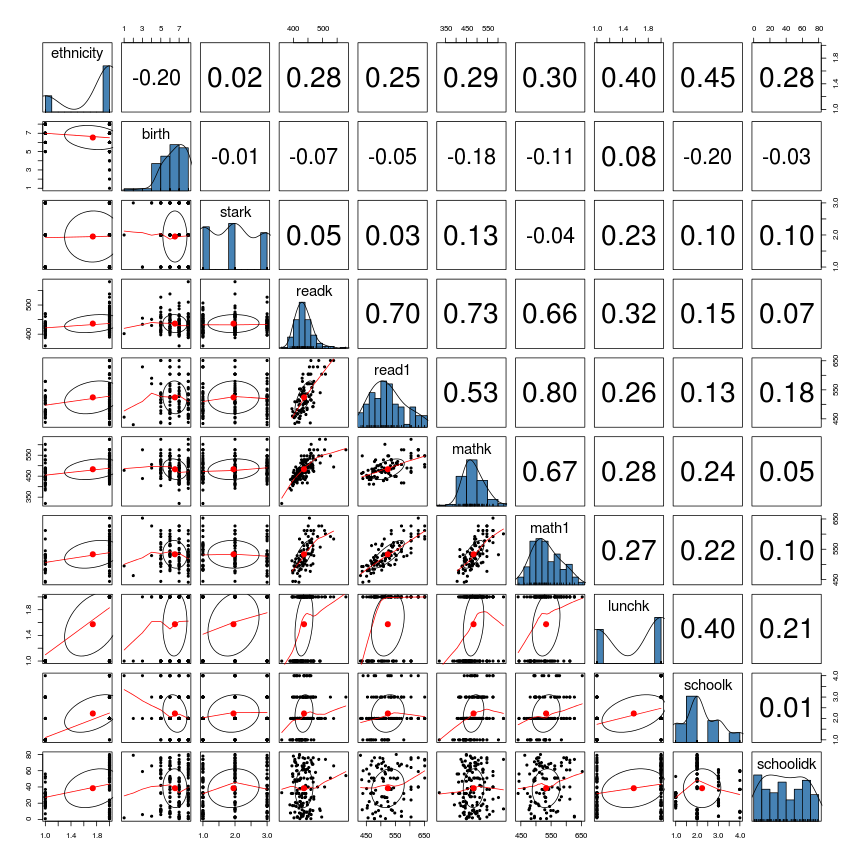

# STAR Example Intent-to-treat Report


## Introduction

This is an example report of the _STAR_ data. The data consists of 150 cases and 11 variables. This example is a simplified version of the types of internal lab reports that can be generated using R and the `knitr` package to produce reproducible analyses. 


## Descriptive Statistics
### Table 1.
<table frame="hsides" rules="groups">
<thead>
<tr class="center">
  <th>&nbsp;</th>
  <th>&nbsp;</th>
  <th colspan="4">schoolk</th>
  <th>&nbsp;</th>
</tr>
 <tr class="center">
  <th></th>
  <th></th>
  <th>inner-city</th>
  <th>rural</th>
  <th>suburban</th>
  <th>urban</th>
  <th>All</th>
</tr>
</thead>
<tbody>
<tr class="center">
  <th class="left">mathk</th>
  <th class="left">Mean</th>
  <td>460.00</td>
  <td>484.50</td>
  <td>492.23</td>
  <td>502.85</td>
  <td>483.28</td>
</tr>
 <tr class="center">
  <th class="left">&nbsp;</th>
  <th class="left">SD</th>
  <td> 56.80</td>
  <td> 46.34</td>
  <td> 44.82</td>
  <td> 46.16</td>
  <td> 49.25</td>
</tr>
 <tr class="center">
  <th class="left">readk</th>
  <th class="left">Mean</th>
  <td>422.48</td>
  <td>438.21</td>
  <td>445.47</td>
  <td>432.69</td>
  <td>436.39</td>
</tr>
 <tr class="center">
  <th class="left">&nbsp;</th>
  <th class="left">SD</th>
  <td> 23.69</td>
  <td> 30.67</td>
  <td> 36.96</td>
  <td> 20.20</td>
  <td> 30.88</td>
</tr>
</tbody>
</table>


### Table 2.
<table frame="hsides" rules="groups">
<thead>
<tr class="center">
  <th></th>
  <th>n</th>
  <th>Mean</th>
  <th>SD</th>
  <th>Min</th>
  <th>Max</th>
</tr>
</thead>
<tbody>
<tr class="center">
  <th class="left">readk</th>
  <td>150</td>
  <td>436.39</td>
  <td>30.88</td>
  <td>360</td>
  <td>580</td>
</tr>
 <tr class="center">
  <th class="left">read1</th>
  <td>150</td>
  <td>524.07</td>
  <td>56.59</td>
  <td>430</td>
  <td>651</td>
</tr>
 <tr class="center">
  <th class="left">mathk</th>
  <td>150</td>
  <td>483.28</td>
  <td>49.25</td>
  <td>320</td>
  <td>626</td>
</tr>
 <tr class="center">
  <th class="left">math1</th>
  <td>150</td>
  <td>533.48</td>
  <td>45.97</td>
  <td>441</td>
  <td>653</td>
</tr>
 <tr class="center">
  <th class="left">schoolidk</th>
  <td>150</td>
  <td> 38.52</td>
  <td>23.90</td>
  <td>  1</td>
  <td> 80</td>
</tr>
</tbody>
</table>

### Descriptive table
<table class='gmisc_table' style='border-collapse: collapse;' >
	<thead>
	<tr>
		<th style='font-weight: 900; border-bottom: 1px solid grey; border-top: 4px double grey;'>dat</th>
		<th style='border-bottom: 1px solid grey; border-top: 4px double grey; text-align: center;'>vars</th>
		<th style='border-bottom: 1px solid grey; border-top: 4px double grey; text-align: center;'>n</th>
		<th style='border-bottom: 1px solid grey; border-top: 4px double grey; text-align: center;'>mean</th>
		<th style='border-bottom: 1px solid grey; border-top: 4px double grey; text-align: center;'>sd</th>
		<th style='border-bottom: 1px solid grey; border-top: 4px double grey; text-align: center;'>median</th>
		<th style='border-bottom: 1px solid grey; border-top: 4px double grey; text-align: center;'>trimmed</th>
		<th style='border-bottom: 1px solid grey; border-top: 4px double grey; text-align: center;'>mad</th>
		<th style='border-bottom: 1px solid grey; border-top: 4px double grey; text-align: center;'>min</th>
		<th style='border-bottom: 1px solid grey; border-top: 4px double grey; text-align: center;'>max</th>
		<th style='border-bottom: 1px solid grey; border-top: 4px double grey; text-align: center;'>range</th>
		<th style='border-bottom: 1px solid grey; border-top: 4px double grey; text-align: center;'>skew</th>
		<th style='border-bottom: 1px solid grey; border-top: 4px double grey; text-align: center;'>kurtosis</th>
		<th style='border-bottom: 1px solid grey; border-top: 4px double grey; text-align: center;'>se</th>
	</tr>
	</thead><tbody>
	<tr>
		<td style='text-align: left;'>gender*</td>
		<td style='text-align: left;'>1</td>
		<td style='text-align: center;'>150</td>
		<td style='text-align: center;'>1.49</td>
		<td style='text-align: center;'>0.5</td>
		<td style='text-align: center;'>1</td>
		<td style='text-align: center;'>1.49</td>
		<td style='text-align: center;'>0</td>
		<td style='text-align: center;'>1</td>
		<td style='text-align: center;'>2</td>
		<td style='text-align: center;'>1</td>
		<td style='text-align: center;'>0.03</td>
		<td style='text-align: center;'>-2.01</td>
		<td style='text-align: center;'>0.04</td>
	</tr>
	<tr>
		<td style='text-align: left;'>ethnicity*</td>
		<td style='text-align: left;'>2</td>
		<td style='text-align: center;'>150</td>
		<td style='text-align: center;'>1.74</td>
		<td style='text-align: center;'>0.44</td>
		<td style='text-align: center;'>2</td>
		<td style='text-align: center;'>1.8</td>
		<td style='text-align: center;'>0</td>
		<td style='text-align: center;'>1</td>
		<td style='text-align: center;'>2</td>
		<td style='text-align: center;'>1</td>
		<td style='text-align: center;'>-1.08</td>
		<td style='text-align: center;'>-0.83</td>
		<td style='text-align: center;'>0.04</td>
	</tr>
	<tr>
		<td style='text-align: left;'>birth*</td>
		<td style='text-align: left;'>3</td>
		<td style='text-align: center;'>150</td>
		<td style='text-align: center;'>6.54</td>
		<td style='text-align: center;'>1.31</td>
		<td style='text-align: center;'>7</td>
		<td style='text-align: center;'>6.66</td>
		<td style='text-align: center;'>1.48</td>
		<td style='text-align: center;'>1</td>
		<td style='text-align: center;'>8</td>
		<td style='text-align: center;'>7</td>
		<td style='text-align: center;'>-1.04</td>
		<td style='text-align: center;'>1.7</td>
		<td style='text-align: center;'>0.11</td>
	</tr>
	<tr>
		<td style='text-align: left;'>stark*</td>
		<td style='text-align: left;'>4</td>
		<td style='text-align: center;'>150</td>
		<td style='text-align: center;'>1.95</td>
		<td style='text-align: center;'>0.8</td>
		<td style='text-align: center;'>2</td>
		<td style='text-align: center;'>1.94</td>
		<td style='text-align: center;'>1.48</td>
		<td style='text-align: center;'>1</td>
		<td style='text-align: center;'>3</td>
		<td style='text-align: center;'>2</td>
		<td style='text-align: center;'>0.08</td>
		<td style='text-align: center;'>-1.43</td>
		<td style='text-align: center;'>0.07</td>
	</tr>
	<tr>
		<td style='text-align: left;'>readk</td>
		<td style='text-align: left;'>5</td>
		<td style='text-align: center;'>136</td>
		<td style='text-align: center;'>436.39</td>
		<td style='text-align: center;'>30.88</td>
		<td style='text-align: center;'>433</td>
		<td style='text-align: center;'>433.69</td>
		<td style='text-align: center;'>27.43</td>
		<td style='text-align: center;'>360</td>
		<td style='text-align: center;'>580</td>
		<td style='text-align: center;'>220</td>
		<td style='text-align: center;'>1.25</td>
		<td style='text-align: center;'>3.4</td>
		<td style='text-align: center;'>2.65</td>
	</tr>
	<tr>
		<td style='text-align: left;'>read1</td>
		<td style='text-align: left;'>6</td>
		<td style='text-align: center;'>97</td>
		<td style='text-align: center;'>524.07</td>
		<td style='text-align: center;'>56.59</td>
		<td style='text-align: center;'>516</td>
		<td style='text-align: center;'>520.57</td>
		<td style='text-align: center;'>56.34</td>
		<td style='text-align: center;'>430</td>
		<td style='text-align: center;'>651</td>
		<td style='text-align: center;'>221</td>
		<td style='text-align: center;'>0.53</td>
		<td style='text-align: center;'>-0.51</td>
		<td style='text-align: center;'>5.75</td>
	</tr>
	<tr>
		<td style='text-align: left;'>mathk</td>
		<td style='text-align: left;'>7</td>
		<td style='text-align: center;'>137</td>
		<td style='text-align: center;'>483.28</td>
		<td style='text-align: center;'>49.25</td>
		<td style='text-align: center;'>478</td>
		<td style='text-align: center;'>481.28</td>
		<td style='text-align: center;'>43</td>
		<td style='text-align: center;'>320</td>
		<td style='text-align: center;'>626</td>
		<td style='text-align: center;'>306</td>
		<td style='text-align: center;'>0.32</td>
		<td style='text-align: center;'>0.59</td>
		<td style='text-align: center;'>4.21</td>
	</tr>
	<tr>
		<td style='text-align: left;'>math1</td>
		<td style='text-align: left;'>8</td>
		<td style='text-align: center;'>101</td>
		<td style='text-align: center;'>533.48</td>
		<td style='text-align: center;'>45.97</td>
		<td style='text-align: center;'>529</td>
		<td style='text-align: center;'>531.56</td>
		<td style='text-align: center;'>48.93</td>
		<td style='text-align: center;'>441</td>
		<td style='text-align: center;'>653</td>
		<td style='text-align: center;'>212</td>
		<td style='text-align: center;'>0.37</td>
		<td style='text-align: center;'>-0.48</td>
		<td style='text-align: center;'>4.57</td>
	</tr>
	<tr>
		<td style='text-align: left;'>lunchk*</td>
		<td style='text-align: left;'>9</td>
		<td style='text-align: center;'>148</td>
		<td style='text-align: center;'>1.57</td>
		<td style='text-align: center;'>0.5</td>
		<td style='text-align: center;'>2</td>
		<td style='text-align: center;'>1.59</td>
		<td style='text-align: center;'>0</td>
		<td style='text-align: center;'>1</td>
		<td style='text-align: center;'>2</td>
		<td style='text-align: center;'>1</td>
		<td style='text-align: center;'>-0.3</td>
		<td style='text-align: center;'>-1.92</td>
		<td style='text-align: center;'>0.04</td>
	</tr>
	<tr>
		<td style='text-align: left;'>schoolk*</td>
		<td style='text-align: left;'>10</td>
		<td style='text-align: center;'>150</td>
		<td style='text-align: center;'>2.23</td>
		<td style='text-align: center;'>0.88</td>
		<td style='text-align: center;'>2</td>
		<td style='text-align: center;'>2.17</td>
		<td style='text-align: center;'>1.48</td>
		<td style='text-align: center;'>1</td>
		<td style='text-align: center;'>4</td>
		<td style='text-align: center;'>3</td>
		<td style='text-align: center;'>0.42</td>
		<td style='text-align: center;'>-0.47</td>
		<td style='text-align: center;'>0.07</td>
	</tr>
	<tr>
		<td style='border-bottom: 1px solid grey; text-align: left;'>schoolidk</td>
		<td style='border-bottom: 1px solid grey; text-align: left;'>11</td>
		<td style='border-bottom: 1px solid grey; text-align: center;'>150</td>
		<td style='border-bottom: 1px solid grey; text-align: center;'>38.52</td>
		<td style='border-bottom: 1px solid grey; text-align: center;'>23.9</td>
		<td style='border-bottom: 1px solid grey; text-align: center;'>37</td>
		<td style='border-bottom: 1px solid grey; text-align: center;'>38.33</td>
		<td style='border-bottom: 1px solid grey; text-align: center;'>31.13</td>
		<td style='border-bottom: 1px solid grey; text-align: center;'>1</td>
		<td style='border-bottom: 1px solid grey; text-align: center;'>80</td>
		<td style='border-bottom: 1px solid grey; text-align: center;'>79</td>
		<td style='border-bottom: 1px solid grey; text-align: center;'>0.04</td>
		<td style='border-bottom: 1px solid grey; text-align: center;'>-1.3</td>
		<td style='border-bottom: 1px solid grey; text-align: center;'>1.95</td>
	</tr>
	</tbody>
</table>


## Barplots

    


## Histograms

    


 


## Intent-to-treat Analyses
### Pretest-posttest Regressions

<!DOCTYPE HTML PUBLIC "-//W3C//DTD HTML 4.01 Transitional//EN" "http://www.w3.org/TR/html4/loose.dtd">
<table cellspacing="0" align="center" style="border: none;">
  <caption align="bottom" style="margin-top:0.3em;">Unstandardized ITT Models</caption>
  <tr>
    <th style="text-align: left; border-top: 2px solid black; border-bottom: 1px solid black; padding-right: 12px;"></th>
    <th style="text-align: left; border-top: 2px solid black; border-bottom: 1px solid black; padding-right: 12px;"><b>Reading</b></th>
    <th style="text-align: left; border-top: 2px solid black; border-bottom: 1px solid black; padding-right: 12px;"><b>Math</b></th>
  </tr>
  <tr>
    <td style="padding-right: 12px; border: none;">(Intercept)</td>
    <td style="padding-right: 12px; border: none;">-97.99</td>
    <td style="padding-right: 12px; border: none;">197.05<sup style="vertical-align: 4px;">***</sup></td>
  </tr>
  <tr>
    <td style="padding-right: 12px; border: none;"></td>
    <td style="padding-right: 12px; border: none;">(73.34)</td>
    <td style="padding-right: 12px; border: none;">(40.81)</td>
  </tr>
  <tr>
    <td style="padding-right: 12px; border: none;">starkregular+aide</td>
    <td style="padding-right: 12px; border: none;">7.88</td>
    <td style="padding-right: 12px; border: none;">2.12</td>
  </tr>
  <tr>
    <td style="padding-right: 12px; border: none;"></td>
    <td style="padding-right: 12px; border: none;">(10.93)</td>
    <td style="padding-right: 12px; border: none;">(8.82)</td>
  </tr>
  <tr>
    <td style="padding-right: 12px; border: none;">starksmall</td>
    <td style="padding-right: 12px; border: none;">6.88</td>
    <td style="padding-right: 12px; border: none;">-10.43</td>
  </tr>
  <tr>
    <td style="padding-right: 12px; border: none;"></td>
    <td style="padding-right: 12px; border: none;">(12.57)</td>
    <td style="padding-right: 12px; border: none;">(10.08)</td>
  </tr>
  <tr>
    <td style="padding-right: 12px; border: none;">pretest</td>
    <td style="padding-right: 12px; border: none;">1.36<sup style="vertical-align: 4px;">***</sup></td>
    <td style="padding-right: 12px; border: none;">0.65<sup style="vertical-align: 4px;">***</sup></td>
  </tr>
  <tr>
    <td style="padding-right: 12px; border: none;"></td>
    <td style="padding-right: 12px; border: none;">(0.17)</td>
    <td style="padding-right: 12px; border: none;">(0.08)</td>
  </tr>
  <tr>
    <td style="padding-right: 12px; border: none;">gendermale</td>
    <td style="padding-right: 12px; border: none;">-1.06</td>
    <td style="padding-right: 12px; border: none;">12.29</td>
  </tr>
  <tr>
    <td style="padding-right: 12px; border: none;"></td>
    <td style="padding-right: 12px; border: none;">(9.35)</td>
    <td style="padding-right: 12px; border: none;">(7.49)</td>
  </tr>
  <tr>
    <td style="padding-right: 12px; border: none;">ethnicitycauc</td>
    <td style="padding-right: 12px; border: none;">8.30</td>
    <td style="padding-right: 12px; border: none;">18.83</td>
  </tr>
  <tr>
    <td style="padding-right: 12px; border: none;"></td>
    <td style="padding-right: 12px; border: none;">(18.51)</td>
    <td style="padding-right: 12px; border: none;">(14.17)</td>
  </tr>
  <tr>
    <td style="padding-right: 12px; border: none;">lunchknon-free</td>
    <td style="padding-right: 12px; border: none;">6.66</td>
    <td style="padding-right: 12px; border: none;">11.63</td>
  </tr>
  <tr>
    <td style="padding-right: 12px; border: none;"></td>
    <td style="padding-right: 12px; border: none;">(11.50)</td>
    <td style="padding-right: 12px; border: none;">(8.91)</td>
  </tr>
  <tr>
    <td style="padding-right: 12px; border: none;">schoolkrural</td>
    <td style="padding-right: 12px; border: none;">13.07</td>
    <td style="padding-right: 12px; border: none;">-7.93</td>
  </tr>
  <tr>
    <td style="padding-right: 12px; border: none;"></td>
    <td style="padding-right: 12px; border: none;">(21.85)</td>
    <td style="padding-right: 12px; border: none;">(16.74)</td>
  </tr>
  <tr>
    <td style="padding-right: 12px; border: none;">schoolksuburban</td>
    <td style="padding-right: 12px; border: none;">10.92</td>
    <td style="padding-right: 12px; border: none;">4.29</td>
  </tr>
  <tr>
    <td style="padding-right: 12px; border: none;"></td>
    <td style="padding-right: 12px; border: none;">(20.26)</td>
    <td style="padding-right: 12px; border: none;">(16.05)</td>
  </tr>
  <tr>
    <td style="padding-right: 12px; border: none;">schoolkurban</td>
    <td style="padding-right: 12px; border: none;">11.78</td>
    <td style="padding-right: 12px; border: none;">-20.67</td>
  </tr>
  <tr>
    <td style="padding-right: 12px; border: none;"></td>
    <td style="padding-right: 12px; border: none;">(24.62)</td>
    <td style="padding-right: 12px; border: none;">(19.47)</td>
  </tr>
  <tr>
    <td style="border-top: 1px solid black;">R<sup style="vertical-align: 4px;">2</sup></td>
    <td style="border-top: 1px solid black;">0.52</td>
    <td style="border-top: 1px solid black;">0.51</td>
  </tr>
  <tr>
    <td style="padding-right: 12px; border: none;">Adj. R<sup style="vertical-align: 4px;">2</sup></td>
    <td style="padding-right: 12px; border: none;">0.46</td>
    <td style="padding-right: 12px; border: none;">0.46</td>
  </tr>
  <tr>
    <td style="border-bottom: 2px solid black;">Num. obs.</td>
    <td style="border-bottom: 2px solid black;">88</td>
    <td style="border-bottom: 2px solid black;">92</td>
  </tr>
  <tr>
    <td style="padding-right: 12px; border: none;" colspan="3"><span style="font-size:0.8em"><sup style="vertical-align: 4px;">***</sup>p &lt; 0.001, <sup style="vertical-align: 4px;">**</sup>p &lt; 0.01, <sup style="vertical-align: 4px;">*</sup>p &lt; 0.05</span></td>
  </tr>
</table>


<!DOCTYPE HTML PUBLIC "-//W3C//DTD HTML 4.01 Transitional//EN" "http://www.w3.org/TR/html4/loose.dtd">
<table cellspacing="0" align="center" style="border: none;">
  <caption align="bottom" style="margin-top:0.3em;">Standardized ITT Models</caption>
  <tr>
    <th style="text-align: left; border-top: 2px solid black; border-bottom: 1px solid black; padding-right: 12px;"></th>
    <th style="text-align: left; border-top: 2px solid black; border-bottom: 1px solid black; padding-right: 12px;"><b>Reading</b></th>
    <th style="text-align: left; border-top: 2px solid black; border-bottom: 1px solid black; padding-right: 12px;"><b>Math</b></th>
  </tr>
  <tr>
    <td style="padding-right: 12px; border: none;">(Intercept)</td>
    <td style="padding-right: 12px; border: none;">-0.53<sup style="vertical-align: 4px;">*</sup></td>
    <td style="padding-right: 12px; border: none;">-0.52<sup style="vertical-align: 4px;">*</sup></td>
  </tr>
  <tr>
    <td style="padding-right: 12px; border: none;"></td>
    <td style="padding-right: 12px; border: none;">(0.25)</td>
    <td style="padding-right: 12px; border: none;">(0.26)</td>
  </tr>
  <tr>
    <td style="padding-right: 12px; border: none;">starkregular+aide</td>
    <td style="padding-right: 12px; border: none;">0.14</td>
    <td style="padding-right: 12px; border: none;">0.05</td>
  </tr>
  <tr>
    <td style="padding-right: 12px; border: none;"></td>
    <td style="padding-right: 12px; border: none;">(0.19)</td>
    <td style="padding-right: 12px; border: none;">(0.19)</td>
  </tr>
  <tr>
    <td style="padding-right: 12px; border: none;">starksmall</td>
    <td style="padding-right: 12px; border: none;">0.12</td>
    <td style="padding-right: 12px; border: none;">-0.23</td>
  </tr>
  <tr>
    <td style="padding-right: 12px; border: none;"></td>
    <td style="padding-right: 12px; border: none;">(0.22)</td>
    <td style="padding-right: 12px; border: none;">(0.22)</td>
  </tr>
  <tr>
    <td style="padding-right: 12px; border: none;">scale(pretest)</td>
    <td style="padding-right: 12px; border: none;">0.74<sup style="vertical-align: 4px;">***</sup></td>
    <td style="padding-right: 12px; border: none;">0.69<sup style="vertical-align: 4px;">***</sup></td>
  </tr>
  <tr>
    <td style="padding-right: 12px; border: none;"></td>
    <td style="padding-right: 12px; border: none;">(0.09)</td>
    <td style="padding-right: 12px; border: none;">(0.09)</td>
  </tr>
  <tr>
    <td style="padding-right: 12px; border: none;">gendermale</td>
    <td style="padding-right: 12px; border: none;">-0.02</td>
    <td style="padding-right: 12px; border: none;">0.27</td>
  </tr>
  <tr>
    <td style="padding-right: 12px; border: none;"></td>
    <td style="padding-right: 12px; border: none;">(0.17)</td>
    <td style="padding-right: 12px; border: none;">(0.16)</td>
  </tr>
  <tr>
    <td style="padding-right: 12px; border: none;">ethnicitycauc</td>
    <td style="padding-right: 12px; border: none;">0.15</td>
    <td style="padding-right: 12px; border: none;">0.41</td>
  </tr>
  <tr>
    <td style="padding-right: 12px; border: none;"></td>
    <td style="padding-right: 12px; border: none;">(0.33)</td>
    <td style="padding-right: 12px; border: none;">(0.31)</td>
  </tr>
  <tr>
    <td style="padding-right: 12px; border: none;">lunchknon-free</td>
    <td style="padding-right: 12px; border: none;">0.12</td>
    <td style="padding-right: 12px; border: none;">0.25</td>
  </tr>
  <tr>
    <td style="padding-right: 12px; border: none;"></td>
    <td style="padding-right: 12px; border: none;">(0.20)</td>
    <td style="padding-right: 12px; border: none;">(0.19)</td>
  </tr>
  <tr>
    <td style="padding-right: 12px; border: none;">schoolkrural</td>
    <td style="padding-right: 12px; border: none;">0.23</td>
    <td style="padding-right: 12px; border: none;">-0.17</td>
  </tr>
  <tr>
    <td style="padding-right: 12px; border: none;"></td>
    <td style="padding-right: 12px; border: none;">(0.39)</td>
    <td style="padding-right: 12px; border: none;">(0.36)</td>
  </tr>
  <tr>
    <td style="padding-right: 12px; border: none;">schoolksuburban</td>
    <td style="padding-right: 12px; border: none;">0.19</td>
    <td style="padding-right: 12px; border: none;">0.09</td>
  </tr>
  <tr>
    <td style="padding-right: 12px; border: none;"></td>
    <td style="padding-right: 12px; border: none;">(0.36)</td>
    <td style="padding-right: 12px; border: none;">(0.35)</td>
  </tr>
  <tr>
    <td style="padding-right: 12px; border: none;">schoolkurban</td>
    <td style="padding-right: 12px; border: none;">0.21</td>
    <td style="padding-right: 12px; border: none;">-0.45</td>
  </tr>
  <tr>
    <td style="padding-right: 12px; border: none;"></td>
    <td style="padding-right: 12px; border: none;">(0.44)</td>
    <td style="padding-right: 12px; border: none;">(0.42)</td>
  </tr>
  <tr>
    <td style="border-top: 1px solid black;">R<sup style="vertical-align: 4px;">2</sup></td>
    <td style="border-top: 1px solid black;">0.52</td>
    <td style="border-top: 1px solid black;">0.51</td>
  </tr>
  <tr>
    <td style="padding-right: 12px; border: none;">Adj. R<sup style="vertical-align: 4px;">2</sup></td>
    <td style="padding-right: 12px; border: none;">0.46</td>
    <td style="padding-right: 12px; border: none;">0.46</td>
  </tr>
  <tr>
    <td style="border-bottom: 2px solid black;">Num. obs.</td>
    <td style="border-bottom: 2px solid black;">88</td>
    <td style="border-bottom: 2px solid black;">92</td>
  </tr>
  <tr>
    <td style="padding-right: 12px; border: none;" colspan="3"><span style="font-size:0.8em"><sup style="vertical-align: 4px;">***</sup>p &lt; 0.001, <sup style="vertical-align: 4px;">**</sup>p &lt; 0.01, <sup style="vertical-align: 4px;">*</sup>p &lt; 0.05</span></td>
  </tr>
</table>


## R Session Information

```
R version 3.1.0 (2014-04-10)
Platform: x86_64-pc-linux-gnu (64-bit)

locale:
 [1] LC_CTYPE=en_US.UTF-8       LC_NUMERIC=C              
 [3] LC_TIME=en_US.UTF-8        LC_COLLATE=en_US.UTF-8    
 [5] LC_MONETARY=en_US.UTF-8    LC_MESSAGES=en_US.UTF-8   
 [7] LC_PAPER=en_US.UTF-8       LC_NAME=C                 
 [9] LC_ADDRESS=C               LC_TELEPHONE=C            
[11] LC_MEASUREMENT=en_US.UTF-8 LC_IDENTIFICATION=C       

attached base packages:
 [1] tcltk     splines   grid      stats     graphics  grDevices utils    
 [8] datasets  methods   base     

other attached packages:
 [1] texreg_1.31          Gmisc_0.6.2.0        reporttools_1.1.1   
 [4] xtable_1.7-3         VIMGUI_0.9.0         gWidgetsRGtk2_0.0-82
 [7] gWidgets_0.0-52      RGtk2_2.20.27        survey_3.29-5       
[10] VIM_4.0.0            colorspace_1.2-4     tkrplot_0.0-23      
[13] tables_0.7.64        Hmisc_3.14-3         Formula_1.1-1       
[16] survival_2.37-7      lattice_0.20-29      psych_1.4.3         
[19] knitr_1.5           

loaded via a namespace (and not attached):
 [1] Cairo_1.5-5         car_2.0-19          class_7.3-10       
 [4] cluster_1.15.2      DEoptimR_1.0-1      e1071_1.6-3        
 [7] evaluate_0.5.3      foreign_0.8-61      formatR_0.10       
[10] glmnet_1.9-5        latticeExtra_0.6-26 MASS_7.3-31        
[13] Matrix_1.1-3        nnet_7.3-8          RColorBrewer_1.0-5 
[16] Rcpp_0.11.1         robustbase_0.90-2   sp_1.0-15          
[19] stringr_0.6.2       tools_3.1.0         vcd_1.3-1          
```


